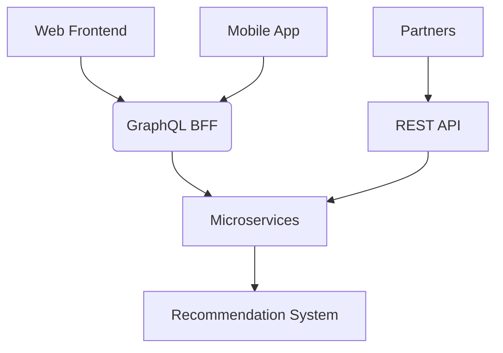

# When to Use GraphQL: Ideal Scenarios and When to Avoid It

GraphQL is a powerful technology, but it's not a universal solution for all API cases. Here's a detailed analysis of when it's a good choice and when other approaches may be more suitable.

## ✅ **When GraphQL is a Good Choice**

### 1. **Clients with variable data needs**
   - **Example**: Mobile and web apps where different screens need different data sets
   - **Advantage**: Avoids over-fetching (getting too much data) and under-fetching (getting insufficient data)

### 2. **Systems with multiple API consumers**
   - **Example**: An API used by web, mobile, IoT, and partners
   - **Advantage**: [Each client can request exactly what it needs without requiring backend changes](GraphQLFlexibility.en.md)

### 3. **Microservices and complex systems**
   - **Example**: Frontend that needs to aggregate data from multiple services
   - **Advantage**: GraphQL can act as a unification layer (BFF - Backend For Frontend)

### 4. **Applications with critical performance requirements**
   - **Example**: Slow mobile networks where payload reduction is crucial
   - **Advantage**: Minimizes the amount of data transferred

### 5. **Rapid product development**
   - **Example**: Startups or MVPs (Minimum Viable Products)
   - **Advantage**: Enables fast frontend iteration without backend changes

## ❌ **When GraphQL is Not the Best Choice**

### 1. **Very simple APIs**
   - **Scenario**: Basic CRUD without data complexity
   - **Problem**: Unnecessary overhead - REST can be simpler
   - **Alternative**: REST or gRPC

### 2. **Systems with critical HTTP-level caching**
   - **Scenario**: Highly cacheable content like CDNs
   - **Problem**: GraphQL uses POST for queries (though solutions like Persisted Queries exist)
   - **Alternative**: REST with GET and HTTP caching headers

### 3. **File upload operations**
   - **Scenario**: Large file uploads
   - **Problem**: GraphQL wasn't originally designed for this
   - **Alternative**: Use REST for uploads or extensions like GraphQL Multipart Request

### 4. **High-traffic public APIs without client control**
   - **Scenario**: Open API for third parties with high volume
   - **Problem**: Difficulty with rate limiting and processing cost of complex queries
   - **Alternative**: REST with well-defined endpoints

### 5. **When you need simple read operations**
   - **Scenario**: Accessing a resource by ID without relationships
   - **Problem**: `GET /users/123` is simpler than a GraphQL query
   - **Alternative**: REST for simple operations

## ⚖️ **Comparative Analysis**

| Criterion               | GraphQL Better | REST Better |
|-------------------------|---------------|-------------|
| Data efficiency         | ✅            | ❌          |
| Simplicity              | ❌            | ✅          |
| Client flexibility      | ✅            | ❌          |
| HTTP caching            | ❌            | ✅          |
| Auto-documentation      | ✅            | ⚠️ (OpenAPI) |
| Complex performance     | ⚠️ (N+1 problem) | ✅        |
| File uploads            | ❌            | ✅          |

## 🛠 **Hybrid Cases**

Many companies use hybrid approaches:
- **GraphQL for frontends** (web/mobile)
- **REST/gRPC for service-to-service communication**
- **GraphQL as aggregation layer** over microservices

Real-world example: GitHub uses REST for its public v3 API and GraphQL for v4, combining the strengths of each approach.

## 📊 **Decision Metrics**

Consider GraphQL when:
1. 30%+ of your REST endpoints have over-fetching problems
2. You have 3+ clients with different data needs
3. Your frontend team frequently waits for backend changes
4. Your average API payload is larger than 10KB with low data utilization

## 🔍 **Practical Decision Example**

**Scenario**: E-commerce platform with:
- Complex website
- Mobile app
- Partner API
- Recommendation system

**Ideal solution**:

In this case:
- GraphQL for web and mobile (benefits from flexibility)
- REST for partners (easier to document and limit)
- Microservices can use any approach internally

GraphQL is a powerful tool when applied in the right contexts, but like any technology, it's not a universal solution. Carefully evaluate your specific requirements before adopting it.