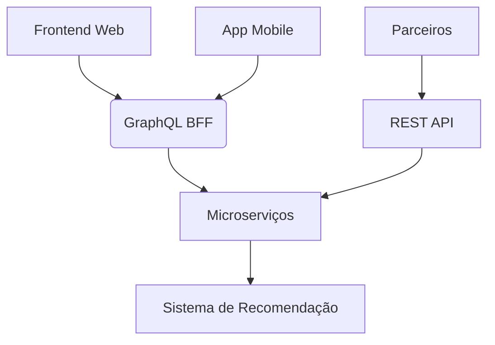

# Quando usar GraphQL: Cenários Ideais e Quando Evitar

GraphQL é uma tecnologia poderosa, mas não é uma solução universal para todos os casos de API. Aqui está uma análise detalhada de quando é uma boa escolha e quando outras abordagens podem ser mais adequadas.

## ✅ **Quando GraphQL é uma Boa Escolha**

### 1. **Clientes com necessidades de dados variáveis**
   - **Exemplo**: Aplicativos móveis e web onde diferentes telas precisam de diferentes conjuntos de dados
   - **Vantagem**: Evita over-fetching (pegar dados demais) e under-fetching (pegar dados de menos)

### 2. **Sistemas com múltiplos consumidores de API**
   - **Exemplo**: Uma API usada por web, mobile, IoT e parceiros
   - **Vantagem**: [Cada cliente pode pedir exatamente o que precisa sem exigir mudanças no backend](GraphQLFlexibility.pt.md)

### 3. **Microserviços e sistemas complexos**
   - **Exemplo**: Frontend que precisa agregar dados de vários serviços
   - **Vantagem**: O GraphQL pode atuar como uma camada de unificação (BFF - Backend For Frontend)

### 4. **Aplicações com requisitos de desempenho crítico**
   - **Exemplo**: Redes móveis lentas onde a redução de payload é crucial
   - **Vantagem**: Minimiza a quantidade de dados transferidos

### 5. **Desenvolvimento rápido de produtos**
   - **Exemplo**: Startups ou MVPs (Produto Mínimo Viável)
   - **Vantagem**: Permite iterar rápido no frontend sem alterar o backend

## ❌ **Quando GraphQL Não é a Melhor Escolha**

### 1. **APIs muito simples**
   - **Cenário**: CRUD básico sem complexidade de dados
   - **Problema**: Overhead desnecessário - REST pode ser mais simples
   - **Alternativa**: REST ou gRPC

### 2. **Sistemas com caching crítico em nível HTTP**
   - **Cenário**: Conteúdo altamente cacheável como CDNs
   - **Problema**: GraphQL usa POST para queries (embora soluções como Persisted Queries existam)
   - **Alternativa**: REST com GET e cabeçalhos HTTP caching

### 3. **Operações de upload de arquivos**
   - **Cenário**: Uploads de grandes arquivos
   - **Problema**: GraphQL não foi projetado para isso originalmente
   - **Alternativa**: Usar REST para uploads ou extensões como GraphQL Multipart Request

### 4. **APIs públicas de alto tráfego sem controle dos clientes**
   - **Cenário**: API aberta para terceiros com alto volume
   - **Problema**: Dificuldade em rate limiting e custo de processamento de queries complexas
   - **Alternativa**: REST com endpoints bem definidos

### 5. **Quando você precisa de operações simples de leitura**
   - **Cenário**: Acessar um recurso por ID sem relacionamentos
   - **Problema**: `GET /users/123` é mais simples que uma query GraphQL
   - **Alternativa**: REST para operações simples

## ⚖️ **Análise Comparativa**

| Critério               | GraphQL Melhor | REST Melhor |
|------------------------|---------------|-------------|
| Eficiência de dados    | ✅            | ❌          |
| Simplicidade          | ❌            | ✅          |
| Flexibilidade do cliente | ✅          | ❌          |
| Caching HTTP          | ❌            | ✅          |
| Documentação automática | ✅           | ⚠️ (OpenAPI) |
| Performance complexa   | ⚠️ (N+1 problem) | ✅        |
| Upload de arquivos     | ❌            | ✅          |

## 🛠 **Casos Híbridos**

Muitas empresas usam abordagens híbridas:
- **GraphQL para frontends** (web/mobile)
- **REST/gRPC para comunicações entre serviços**
- **GraphQL como camada de agregação** sobre microsserviços

Exemplo real: GitHub usa REST para sua API pública v3 e GraphQL para v4, combinando os pontos fortes de cada abordagem.

## 📊 **Métricas para Decisão**

Considere GraphQL quando:
1. 30%+ dos seus endpoints REST têm problemas de over-fetching
2. Você tem 3+ clientes com necessidades de dados diferentes
3. Seu time frontend frequentemente espera por mudanças no backend
4. Seu payload médio de API é maior que 10KB com baixa utilização dos dados

## 🔍 **Exemplo Prático de Decisão**

**Cenário**: Plataforma de e-commerce com:
- Site web complexo
- App mobile
- API para parceiros
- Sistema de recomendação

**Solução ideal**:

Neste caso:
- GraphQL para web e mobile (beneficia da flexibilidade)
- REST para parceiros (mais fácil de documentar e limitar)
- Microsserviços podem usar qualquer abordagem internamente

GraphQL é uma ferramenta poderosa quando aplicada nos contextos corretos, mas como qualquer tecnologia, não é uma solução universal. Avalie cuidadosamente seus requisitos específicos antes de adotar.